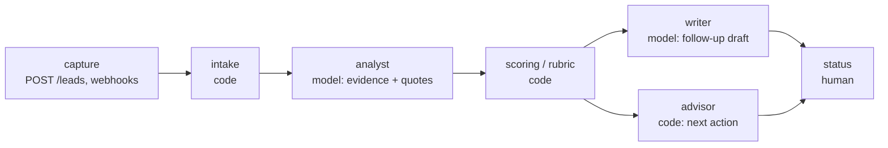

# BrightPath backend (archived snapshot)

The first build session of the BrightPath AI sales assistant: a Next.js API that
captures sales leads, extracts evidence from them with an LLM, and scores them with
deterministic code. Kept as a record of that session.

> **This repository is frozen.** Development continued in
> **[lordgen-brightpath-dashboard](https://github.com/Kikobazz123/lordgen-brightpath-dashboard)**,
> which contains this backend reworked (auth, rate limiting, mail, a longer failover
> chain, rubric 1.1.0) plus the full leads UI, tests and CI. Read that one first.

Built by **[Lordmark Dorgu](https://github.com/Kikobazz123)** for AI BuildFest 2026.

<!-- TODO: add screenshot (or link the dashboard's live demo) -->

---

## The problem it solves

BrightPath Solutions receives leads from several channels, none of which is a queue,
so the valuable ones go cold unnoticed. The backend gives every lead the same path:
capture, analysis, a score against a written rubric, a drafted follow-up, and one
recommended next action, with a first-touch SLA clock running from the moment it
arrives.

## Stack

Next.js 16 App Router (API routes) · TypeScript · Zod 4 contracts · Drizzle ORM ·
Neon serverless Postgres · Gemini / Groq / OpenRouter / Anthropic, or a built-in stub ·
pnpm. The UI shell is the MIT
[shadcnstore dashboard template](https://github.com/shadcnstore/shadcn-dashboard-landing-template);
the BrightPath work is under `src/lib/`, `src/app/api/v1/` and `scripts/`.

## Architecture



```
src/lib/contracts/leads.ts   Zod contracts shared by API and UI (evidence, score, lead)
src/lib/pipeline/            intake, analyst, rubric, scoring, writer, advisor
src/lib/ai/provider.ts       provider abstraction, fallback provider, stub
src/lib/leads/service.ts     every query goes through here, tenant filter included
src/lib/api/http.ts          response envelope, bearer auth, error mapping
src/lib/db/                  Drizzle schema (leads, activities, analysis_runs) and client
src/app/api/v1/              12 route files: leads CRUD and import, analyze, score,
                             follow-up, confirm-send, next-action, status, activity,
                             stats, per-source webhooks
scripts/                     verify-scoring, verify-journey, seed, db-status
```

## Run locally

```bash
pnpm install
cp .env.example .env.local       # every variable is documented there
npx drizzle-kit push             # create the tables in your Neon database
npx tsx --env-file=.env.local scripts/seed.ts
pnpm dev                         # serves on $BASE_URL
```

With `AI_PROVIDER="stub"` (the default) it runs with no API key and returns labelled
placeholder output. Set `DEMO_API_TOKEN` before exposing it anywhere: **with no token
configured the API is open**, by design for local use.

## Tests

No test framework in this snapshot. Two scripts:

```bash
npx tsx scripts/verify-scoring.ts                           # no DB, network or key
npx tsx --env-file=.env.local scripts/verify-journey.ts     # needs a real database
```

`verify-scoring` checks rubric determinism across 200 runs, independence from
evidence order, both gates, and that the contract rejects fabricated evidence. The
session's handoff notes record `verify-journey` as written but not yet run here. The
dashboard repo runs the equivalent checks as Vitest in CI.

## Design decisions and trade-offs

- **The model extracts evidence; code computes the score.** The analyst returns
  facts, each with the verbatim `source_span` it came from. The rubric
  (`brightpath-bant-1.0.0`) turns facts into points. A prompt cannot be diffed or
  reproduced, so scoring never moves into one.
- **Absent is not zero.** Missing required evidence withholds the score (`null`) and
  marks the lead `NEEDS_REVIEW` rather than inventing a number.
- **Gates beside the weighted total.** An explicit "no budget" disqualifies, and HIGH
  priority requires an explicitly stated need, because a weighted sum lets four good
  signals outvote one fatal one.
- **The stub is a first-class provider.** A demo cannot fail on a missing key, and a
  provider outage degrades to `NEEDS_REVIEW` instead of losing the lead. Losing a
  lead is worse than a failed analysis, so capture succeeds even if the pipeline
  does not.
- **Public capture is create-only.** The capture route and webhooks need no token,
  but they can only insert: "the open door leads into an empty room".
- **Nothing is marked sent without proof.** `confirm-send` requires a provider
  message id; otherwise a draft stays a draft.
- **The writer never sees the score**, so a follow-up cannot leak internal
  qualification language to a prospect. `raw_context` is stored untouched next to
  the normalised text so an extraction can be audited later.

Known gaps in this snapshot, all addressed in the dashboard repo: no rate limiting on
the public routes, `.env.example` suggests a guessable demo token, `pnpm lint` uses
the `next lint` command that Next 16 removed, and no migrations are committed.

## Licensing

[`License.md`](License.md) reproduces the MIT notice of the UI template only. It
makes no statement about the BrightPath-specific code; the dashboard repo's
`License.md` covers both.
